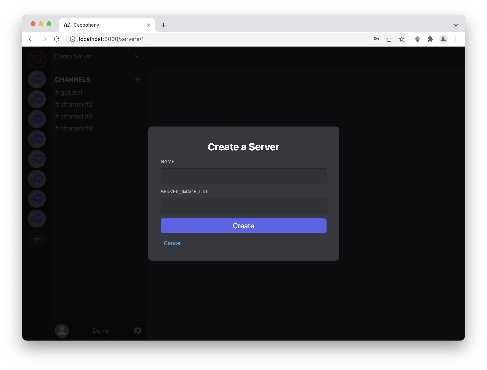
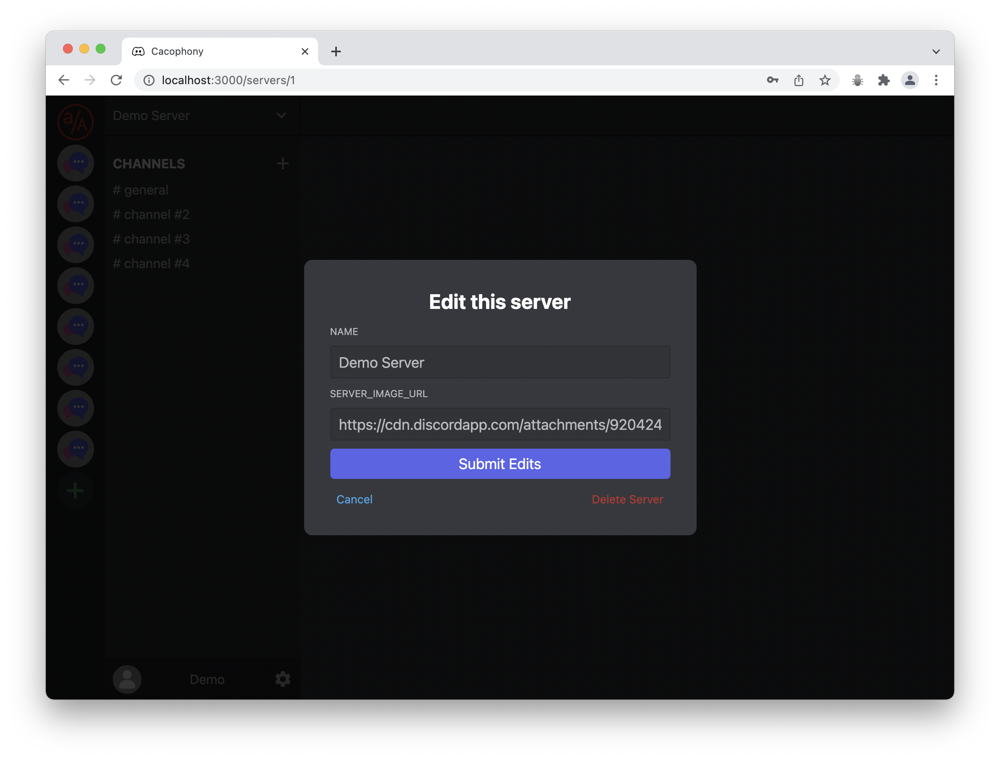

## Summary
[Cacophony](https://cacophony-chat.herokuapp.com/) is a Discord clone with very slight variations to HTML/CSS.  Users can sign-up/login, create servers with chat channels, and send messages on a given channel.  Logged in users can also edit/delete their own servers, channels, and messages.

## Overall Structure
The app includes the following four features: full CRUD for servers, full CRUD for channels, and full CRUD for messages.
Also, Cacophony uses websockets to broadcast updates to all connected users.

### List of features
* Create an account
* Login and logout
* Login as a demo user
* Create a server by clicking the create server symbol in the server-list sidebar.
* Edit a server's details
* Delete a server
* Create a channel on a server
* Edit a channel
* Delete a channel
* Create a message within a channel
* Edit a message
* Delete a message
* Web sockets

## Backend
All backend routes were designed in Flask using Python coding language

## Frontend
All frontend routes and components were designed in React using Javascript coding language

## Dependencies
* alembic
* bidict
* click
* dnspython
* email-validator
* eventlet
* faker
* flask-cors
* flask-login
* flask-migrate
* flask-socketio
* flask-sqlalchemy
* flask-wtf
* flask
* greenlet
* gunicorn
* idna
* itsdangerous
* jinja2
* mako
* markupsafe
* python-dateutil
* python-dotenv
* python-editor
* python-engineio
* python-socketio
* randomuser
* setuptools
* six
* sqlalchemy
* text-unidecode
* werkzeug
* wtforms

## Splash Page
When a user first visits the website, they are presented with a Splash page that includes demo, login, and sign up links.

## Login Page
When a user clicks login on the splash page, they are redirected to the login form.

## Sign-up Page
When a user clicks sign up on the splash page, they are redirected to the sign-up form to create an account.

## Home Page
Once a user signs up or logs in, they are redirected to the home page where they can view all servers they are members of. If a user did not logout the last time they visited the website, their user persists and will take them to the home page automatically.

## Create Server Modal
By clicking on the create a server button (plus symbol) in the left-navbar, the user is sent to the create a server modal. The user can create a server including a name and optional photo.

## Edit Server Modal
By clicking on the edit a server button (drop-down arrow) next to the server name, the user is sent to the edit a server modal. The user can edit server details and delete a server from here.

## Create Channel Modal
By clicking on the create a channel button (plus symbol) in the channel list, the user is sent to the create a channel modal. This feature is only available to a server's owner

## Create Messages
Users can send messages within channels, if they are members of a given server.

## Edit Messages
If a user is a message creator, they have the ability to edit/delete a given message.

